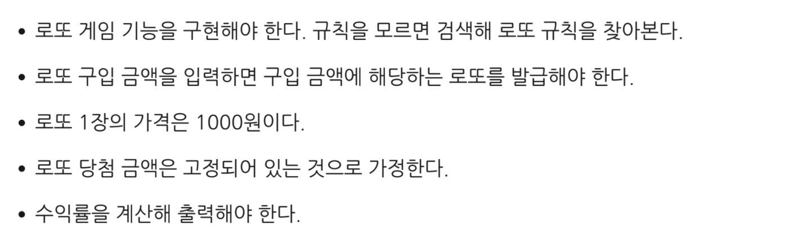

# java-lotto
# 로또게임 저장소

# 구현해야 할 기능 목록
+ 구입 금액 입력받기
  + 입력값이 올바른 값인지 확인
+ 1~45사이의 랜덤 변수를 생성
  + 중복 검사
+ 구입 금액에 맞게 로또 리스트 생성
+ 생성된 로또 리스트를 출력
+ 위닝 로또 생성
  + 지난 주 당첨 번호, 보너스 입력
    + 입력값이 올바른 값인지 확인
+ 결과 출력을 위한 HashMap 생성
+ 전체 Rank Count 출력하는 기능, 수익률 출력하는 기능
